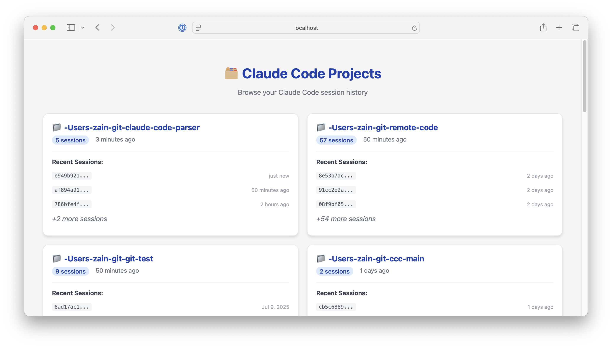
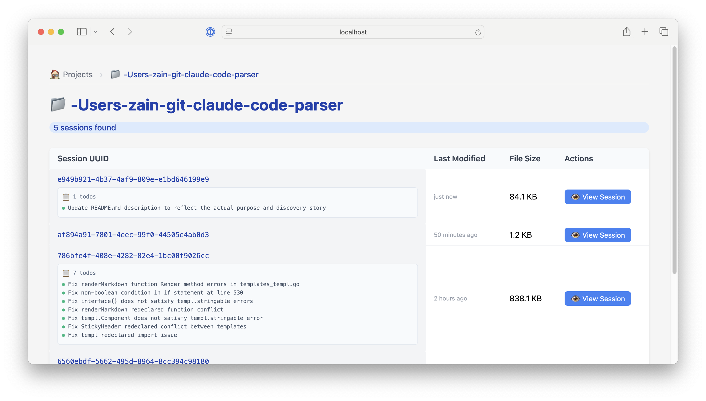
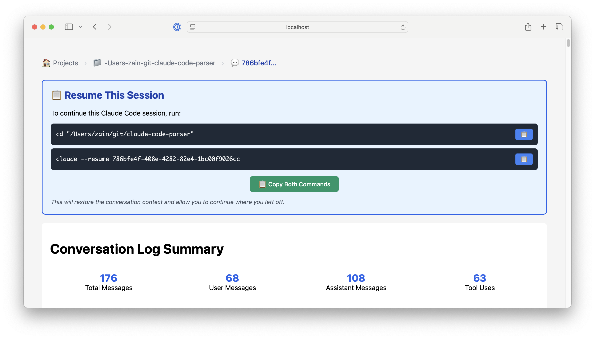
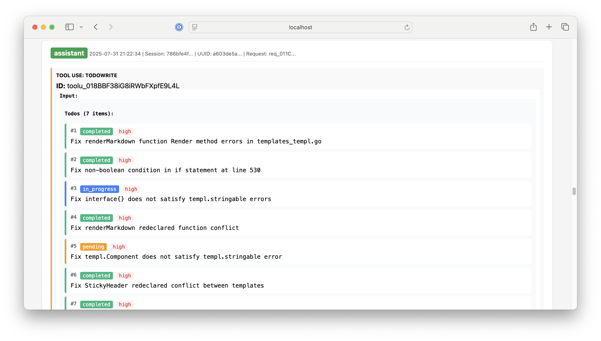
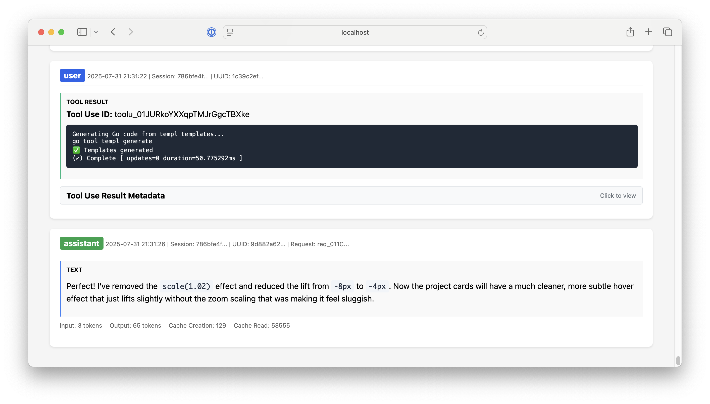

# Claude Code Browser

**Did you know that Claude Code stores all your conversations locally on your computer with tons of metadata?** This is how other tools can track Claude Code costs and utilization.

I got curious about what was actually contained in these files and ended up building a web app that lets you browse all the repositories you've used Claude Code with. You can click into any conversation to see detailed information including:

- All tool calls (Read, Edit, Bash, Grep, etc.)
- Token counts (input, output, cached)
- File operations and modifications
- Web searches performed
- Todo list status and progress
- Complete conversation history

Plus, there's a resume command at the top of each session so you can jump back into any conversation using the `--resume` flag.

The codebase extracts way more structured data than what's published in Anthropic's SDK documentation - I've gone deep into the JSON format to create strongly-typed Go structs, making it possible to build very tailored interfaces on top of this data.

## Screenshots

### Project Overview
Browse all your Claude Code projects with session counts and recent activity:



### Session Details
View all sessions within a project, with todo summaries and file sizes:



### Resume Commands
Easy-to-copy commands to resume any conversation:



### Todo Tracking
Visual todo lists with status indicators and priority levels:



### Conversation Details
Complete conversation logs with token counts and tool metadata:



## Features

- **Dual Mode Operation**:
  - **CLI Mode**: Process individual JSONL files and generate standalone HTML reports
  - **Web Server Mode**: Browse all Claude Code projects and sessions through a web interface

- **Type-Safe Parsing**: Intelligently routes JSON data to specific structs based on message types and tool usage
- **Rich HTML Output**: Custom templates with syntax highlighting and tool-specific formatting
- **Tool Support**: Handles 7 different Claude Code tool types with dedicated input parsing

## Quick Start

### Setup
```bash
make setup          # Initialize dependencies and install templ tool
make generate       # Generate Go code from .templ files  
make build          # Build standalone binary
```

### CLI Mode (Single File Processing)
```bash
make run            # Quick run with default JSONL file
make run-file FILE=data.jsonl OUTPUT=report.html  # Custom input/output
```

### Web Server Mode (Browse All Sessions)
```bash
make server         # Start web server on port 8080
make server-port PORT=3000  # Start on custom port
```

## Development

### Quick Development Workflow
```bash
make dev            # Complete setup -> generate -> run pipeline
make check          # Full validation (fmt + vet + test + build)
```

### Template Development
Always run `make generate` after editing `.templ` files. The generated `templates_templ.go` file must not be edited manually.

## Architecture

### Data Flow Pipeline
1. **JSONL Parsing** - Reads large JSONL files with 10MB buffer support
2. **Struct Mapping** - Converts raw JSON to typed structs based on message/tool types  
3. **HTML Generation** - Uses templ library to render structured HTML output

### Core Components

- **structs.go** - Complete data model hierarchy with LogEntry, Message, and ContentBlock types
- **templates.templ** - templ template definitions with embedded CSS and tool-specific formatters
- **server.go** - Web server handlers for project and session browsing
- **helpers.go** - Statistical functions for template data

### Supported Tools

The application models 7 different Claude Code tool types:
- **TodoWrite**: Todo list management with status tracking
- **Edit**: File modifications with side-by-side comparison
- **Bash**: Command execution with terminal-style display
- **Read**: File reading with syntax highlighting
- **Glob**: Pattern matching with structured output
- **Grep**: Text search with multiple output modes
- **LS**: Directory listing

## Web Interface

- `/` - Project index (lists all projects from `~/.claude/projects`)
- `/project/{name}` - Project detail (shows all JSONL sessions)
- `/session/{project}/{uuid}` - Session viewer (full conversation display)

## Data Format

Claude Code Browser processes JSONL files typically containing:
- Mixed user/assistant messages with tool usage
- Large line sizes requiring specialized buffering
- Files stored in `~/.claude/projects/{project-name}/{session-uuid}.jsonl`